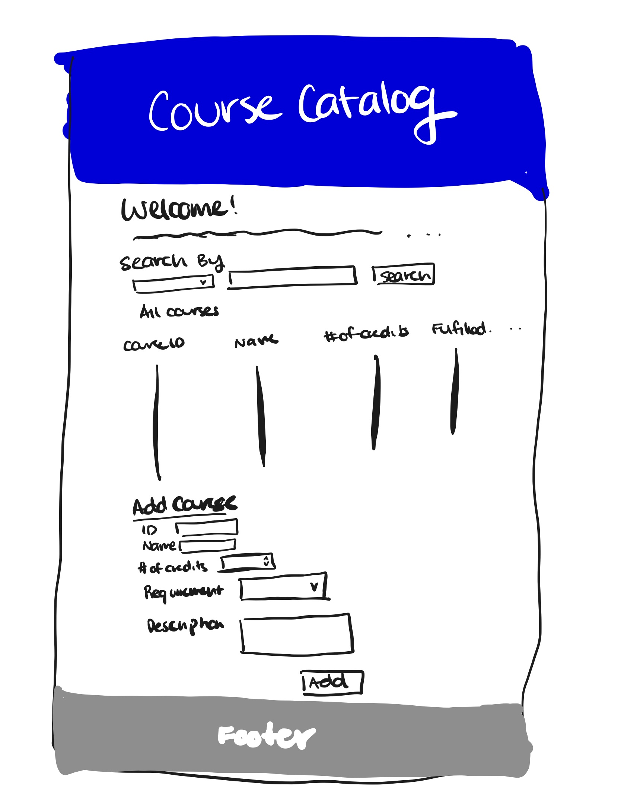

# Project 2: Design Journey

Be clear and concise in your writing. Bullets points are encouraged.

**Everything, including images, must be visible in VS Code's Markdown Preview.** If it's not visible in Markdown Preview, then we won't grade it.

## Catalog (Milestone 1)

### Describe your Catalog (Milestone 1)
> What will your collection be about? What types of attributes will you keep track of for the *things* in your catalog? 1-2 sentences.

My collection will be about a course catalog for ISST majors. There will be attributes for larger categories for the major requirements like Liberal Studies requirement, major-approved elective requirement, major core requirements, etc. These will keep track of each courses that go underneath each category.
Attribuets: Name of course, number of credits, which requirement is fulfilled, description, professor name.

### Target Audience(s) (Milestone 1)
> Tell us about your target audience(s).

My target audience will be anyone interested in becoming a ISST major to show them options of courses they would be taking, or students who are already in an ISST major, looking for courses to take.

### Design Patterns (Milestone 1)
> Review some existing catalog that are similar to yours. List the catalog's you reviewed here. Write a small reflection on how you might use the design patterns you identified in your review in your own catalog.

I reviewed Cornell's course rosters, Cornell Engineering's liberal studies catalog, Cornell's degree requirements page on Information Science website, as well as Cornell's Courses of Study Search.
These catalogs use broader categories to organize each type and branch into smaller items. They also organize using a specfic order like alphabetizing or using numerical codes.


## Design & Planning (Milestone 2)

## Design Process (Milestone 2)
> Document your design process. Show us the evolution of your design from your first idea (sketch) to design you wish to implement (sketch). Show us the process you used to organize content and plan the navigation, if applicable.
> Label all images. All labels must be visible in VS Code's Markdown Preview.
> Clearly label the final design.

First sketch:


This is the first sketch I created for the course catalog. I put all the content I would need on the website and there is no color. It is a basic ordering of what I wanted on the website.
I am not satisfied with the layout or the aesthetics of the website.


Second sketch:


This is the second draft of the website design for the course catalog. I changed the position of the search bar and made the form to be vertically aligned to the left side with the add button on the right side to follow users' eyes. It has all the content needed, has a clear layout but I think it is not very pleasing yet.

Final design:



This was my final design. I like that it has a simple layout with clear headers so that users can focus effectively on the content. It is usable and is easy to use so users can search, add, and observe courses, which was the purpose of the website. I am also satisfied with the layout and the color of the design.

## Partials (Milestone 2)
> If you have any partials, plan them here.

This catalog will be on one page, so partials are not necessary.

## Database Schema (Milestone 2)
> Describe the structure of your database. You may use words or a picture. A bulleted list is probably the simplest way to do this. Make sure you include constraints for each field.

Table: courses
- id: INTEGER {PK, U, NN}
- name: TEXT {NN}
- numcredits: INTEGER {NN}
- req: TEXT {NN}
- description: TEXT {NN}

None of the elements can be NULL.

## Database Query Plan (Milestone 2)
> Plan your database queries. You may use natural language, pseudocode, or SQL.]

1. All records

    ```
    SELECT *
    FROM courses;
    ```

2. Search records

    ```
    from one of the field chosen in the courses data table, get user input find records that match the user input
    ```

3. Insert record

    ```
    get user input, insert user input into database matching its corresponding fields
    ```


## Code Planning (Milestone 2)
> Plan any PHP code you'll need here.

    ```
    $db = open_sqlite_db("secure/courses.sqlite");

    <?php
        $sql = "SELECT* FROM courses;";
        $result = exec_sql_query($db, $sql);
        $records = $result->fetchAll();
        ?>
    <table>
      <tr>
        <th>Course ID</th>
        <th>Course Name</th>
        <th>Number of Credits</th>
        <th>Fulfils Requirement</th>
        <th>Description</th>
      </tr>
      <?php
      foreach ($records as $record) {
        print_record($record);
      }
      ?>
    </table>

    ```


# Reflection (Final Submission)
> Take this time to reflect on what you learned during this assignment. How have you improved since Project 1? What things did you have trouble with?
